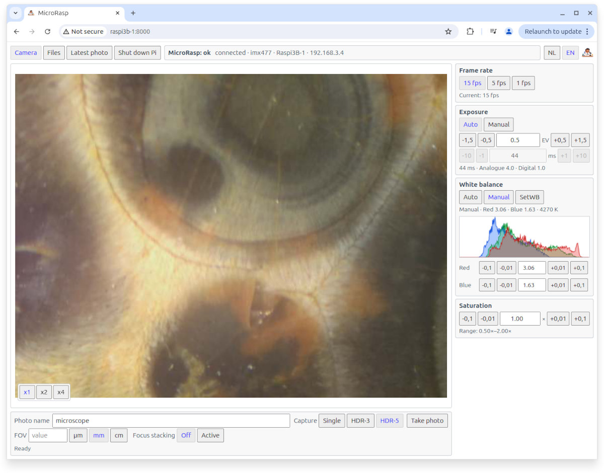
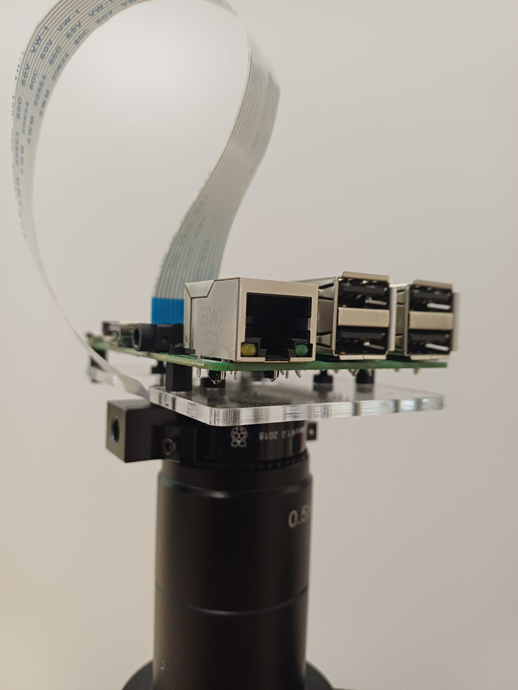
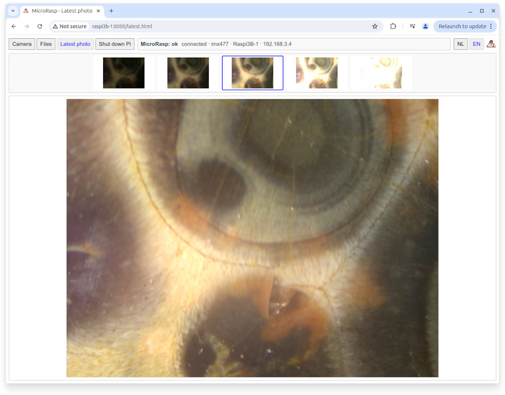
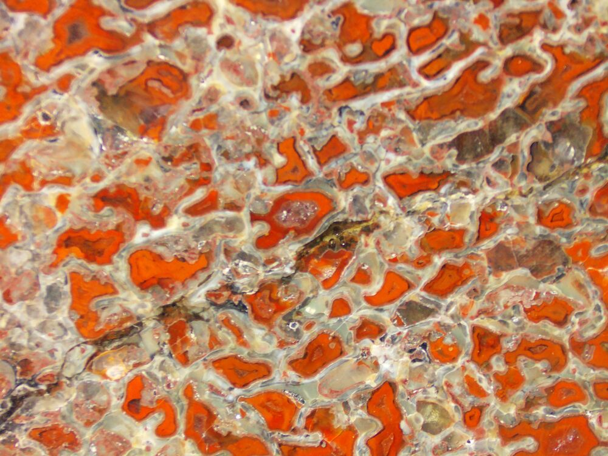
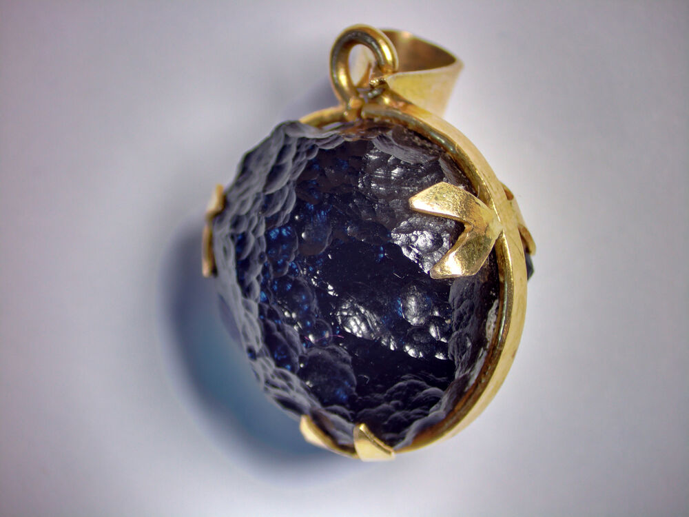
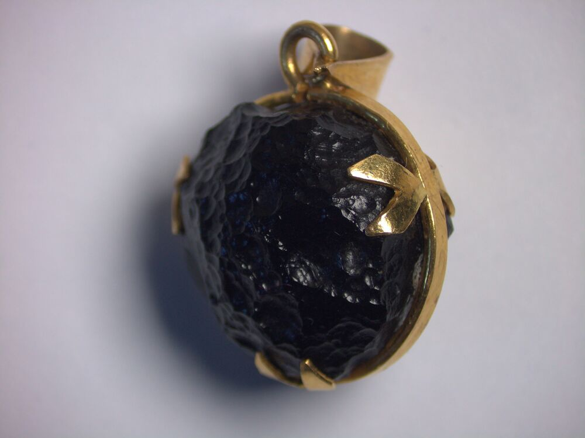
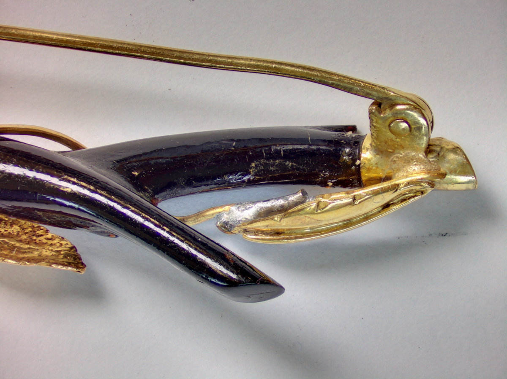
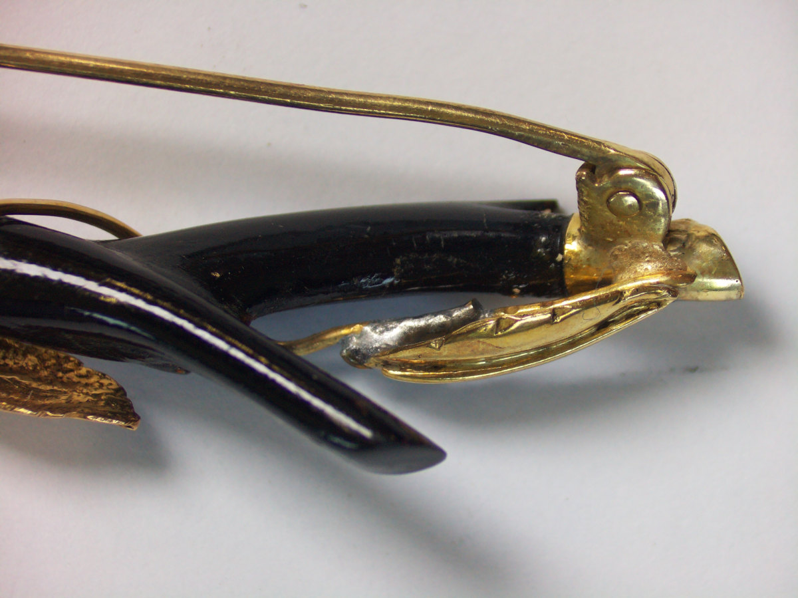

[English](README.md) | [Nederlands](README.nl.md)

>[!NOTE]
>The English version of the Readme is AI-translated from the original Dutch one.

# Microscope-Picam2

Package for using the HQ camera and a Raspberry Pi, specifically with a microscope. This is a new version of Microscope-Picam, now based on libcamera and Picamera2. The aim is to take photographs; video is not supported.

*The user interface*

# Background

I am a gemologist and a software developer. Because I have several microscopes, I was looking for a solution that would allow me to equip all of them with, above all, a lightweight camera. Support for HDR and focus stacks was also necessary. The Pi + HQ hardware is (was?) cheaper, more flexible and lighter than a DSLR. And because I have four Pi/HQ setups, each microscope has its own permanent installation. To my surprise, there was no package for the Pi that offered this with the features I wanted. Five years ago I built something similar, but that is no longer supported by the newer OS. In 2021 I programmed everything myself; this package was vibe-coded in pleasant collaboration with ChatGPT 5.6 Sol.

The basic software was ready in a week. Turning it into a distributable product took another 10 times as long.

*The C-mount connection with the reduction lens. The standard acrylic plate was used so that the camera and Pi form a single unit.*

# Technical

The Pi and camera are connected to the microscope through C-mount. Communication is via Wi-Fi. Only a power cable is required. The software works on a Pi 3B or newer; operation has actually been tested on the Pi 3B+ and Pi 4. A small web server runs on the Pi, allowing the camera to be controlled from a browser on the network.

The files can most easily be accessed from the Pi through an SFTP connection. It is of course also possible to enable the desktop on the Pi. The terminal can also be used.

# Installation

Installation assumes that the latest version of Trixie is installed on the SD card. This can be either the Lite version or the desktop version, although the latter soon becomes rather heavy for a Pi 3B+. The HQ camera must also be connected and tested with rpicam-still.

Download the ZIP, unzip it into a directory on the Pi and run the install.sh script. At the end, the installation is checked. If there are problems, the check-installation.sh script can be run; this tests whether all required components are present.

Photo files are stored in the photos directory under the installation directory. I have deliberately not made this configurable in order to keep things unambiguous.

*The camera can be reached at: http://address-of-the-pi:8000*

The host accessing the camera must be able to reach the Pi on port 8000.

The installation script installs a service so that the web server starts when the Pi boots. If this is not wanted, it can be disabled with the disable-autostart.sh script. The enable-autostart.sh script enables it again. There are also start and stop scripts for starting and stopping the web server separately.

Before removing the software, first run the uninstall.sh script. The directory can then be removed. Software packages installed by the installer are not removed by uninstall.sh.

To upgrade, download the new version, unzip it over the existing installation, and then run the install script again.

# Features

Regular photographs

Standard bracketed photographs, either three exposures at -1.5 EV, 0 and +1.5 EV, or five exposures at -3 EV, -1.5 EV, 0, +1.5 EV and +3 EV. The step size can be changed in .env.local.

Manual stack. After activation, the frame number is automatically increased after each frame while the YYMMDD-HHMMSS part of the filename remains unchanged between the different frames.

Manual Field Of View entry

Automatic exposure, with or without compensation, or manual exposure. At 15 fps, the preview window cannot use shutter times longer than 66 ms. For longer shutter times in the preview, 5 fps must be selected. There is currently a limitation of a maximum shutter time of 120 ms in the preview window.

Saturation adjustment

Histogram

White balance. This can be either automatic or manual. In practice, automatic white balance does not work particularly well for microscope photographs. The best method is to place a white surface under the objective using the illumination that will be used, then press SETWB. In the histogram, the green, blue and red curves will usually move towards each other; the fine adjustment can then be used to place the blue and red curves over each other.

At the top left there is a Files tab. This is a very rudimentary file browser from which image files can be downloaded. The software assumes that during normal use the photos directory will be accessed through a terminal or SFTP. Using SFTP requires SSH to be enabled on the Pi.

There is also a Last Photo tab. All images / brackets from the last photograph are displayed to give an impression of the result.

Finally there is the "Stop PI" tab. This sends the Pi a shutdown signal, which disconnects the camera.

At the top right there is a language setting: NL or EN.

*The tab showing the most recently taken photographs*

# Filenames

Because many files are created, the naming scheme is rigid.

## Single captures

Filename: YYMMDD-HHMMSS-[entered name].jpg

## Bracket files (HDR)

Filename: YYMMDD-HHMMSS-[entered name]-AEB-[stops].jpg

*Photograph of a dinosaur bone*

## Stacking frames

Filename: YYMMDD-HHMMSS-[frame number]-[entered name]-[AEB-[stops]].jpg

# Processing files

For the best result, photographs will usually need to be post-processed individually. A script called "mertens.sh" is included in the photos directory. It uses defaults to create an initial processed photo set. Usage: ./mertens.sh YYMMDD-HHMMSS. For AEB brackets, processing is done using enfuse and magick. This generates the file YYMMDD-HHMMSS-[entered name].jpg, as well as a .tif file for possible further processing and a contrast-enhanced file YYMMDD-HHMMSS-[entered name]-contrast.jpg. The latter can sometimes produce quite substantial colour changes, and sometimes it works perfectly.

For stacking frames, a directory named YYMMDD-HHMMSS-focusstack is generated. For each frame, a .tif file is created if brackets were used, or a .jpg file for single photographs. These can then be processed further in stacking software.

# Pull requests, Issues

Issues can be submitted. They are handled on an irregular basis.

I do not accept pull requests. In this AI era I resolve these myself in order to retain control. After all, this software opens a web server somewhere on a network, which means I would have to review every pull request to make sure it does not contain a backdoor. Usually it probably will not. So if there is a problem, submit an issue.

**License:** [GNU AGPL v3](LICENSE). External code contributions and pull requests are not accepted.

*Photograph of tektite based on five brackets*

*The same photograph, but as a single exposure. Much less detail is visible in the black areas.*

## Effect of HDR and stacking

The effect can be subtle, but the stacked HDR version shows more detail and sharpness than the single photograph.
This is especially visible in the front branch, the detail in the hinge, and the soldering. This is the difference between an OK-ish image and
an image that shows everything clearly in a single view. It is a detail of a brooch containing four types of joints:
gold solder, lead-tin solder, glue and a riveted joint.

*The stacked HDR version*

*A single photograph focused on the middle.*
