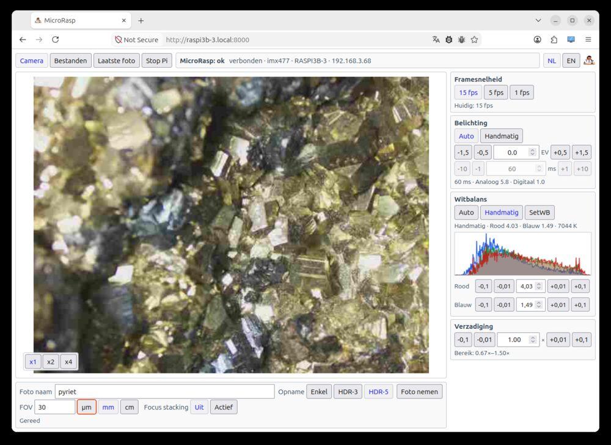
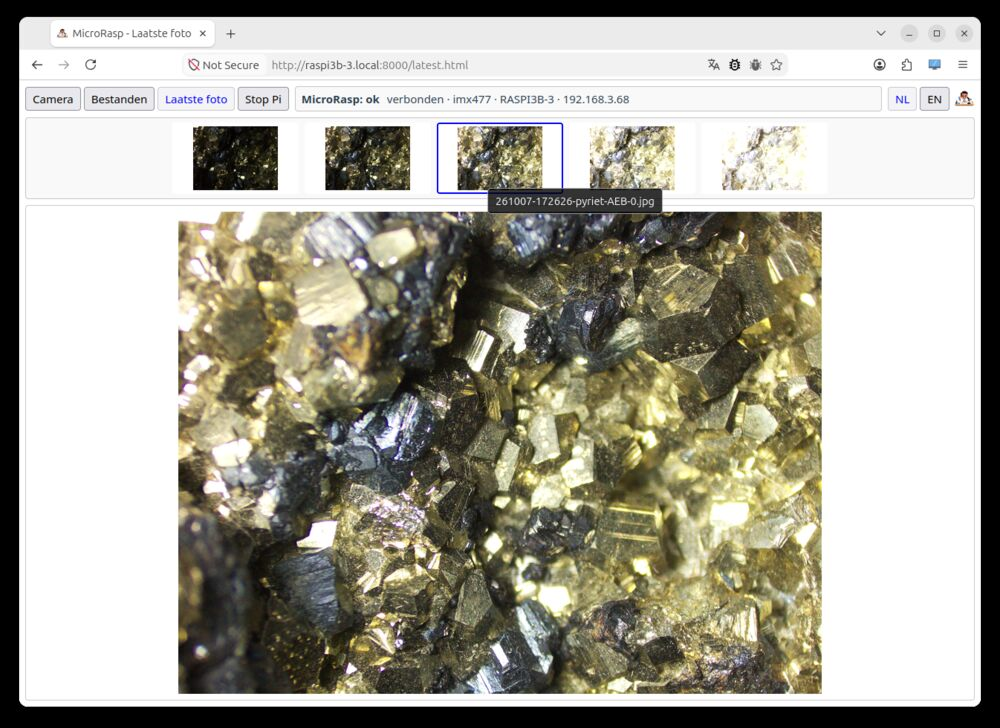

[English](README.md) | [Nederlands](README.nl.md)

# Microscope-Picam2

Pakket voor het gebruik van de HQ camera en een raspberry pi, specifiek voor een microscoop. Dit is een nieuwe versie van Microscope-Picam, maar nu gebaseerd op libcamera en Picamera2. Het doel is het maken van foto's, geen ondersteuning van video.

*De gebruikersinterface*

# Achtergrond

Ik ben een edelsteenkundige (gemmoloog), en een software-ontwikkelaar. Omdat ik een aantal microscopen heb, zocht ik naar 
een oplossing om deze alle te voorzien van vooral een lichtgewoicht camera. Daarbij was ook
ondersteuning van HDR en focus stacks noodzakelijk. De hardware van Pi + HQ is (was?) goedkoper en flexibeler
en minder zwaar dan een DSLR. En doordat ik vier Pi/HQ instanties heb
heeft iedere microscoop zijn eigen permanente installatie. Tot mijn verbazing was er geen pakket voor de Pi die dit biedt 
met de door mij gewenste functies. Vijf jaar geleden heb ik iets soortgelijks gebouwd, maar dit wordt niet meer ondersteund door 
de nieuwe OS. In 2021 programmeerde ik alles zelf, dit pakket is gevibecode in aardige samenwerking met Chatgpt 5.6 Sol.

De basissoftware was gereed in een week. Een distributeerbaar product duurde nog eens 10x zo lang.

*De cmount verbinding met de reductielens. Er is gebruik gemaakt van het standaard acryl plaatje zodat camera en Pi een geheel vormen*

# Technisch

De PI en de camera zijn via CMOUNT aan de microscope verbonden. De communicatie is via wifi. Alleen een voedingskabel is nodig. De software werkt vanaf Pi3B, waarbij werking op de Pi3B+ en PI4 daadwerkelijk getest is. Op de PI draait een kleine webserver, zodat de camera via een browser in het netwerk kan worden bestuurd. 

De bestanden kunnen het meest eenvoudige via een SFTP verbinding van de PI worden gelezen. Het is natuurlijk ook mogelijk om de desktop op de PI te activeren. Daarnaast kan de terminal worden gebruikt.

# Installatie

De installatie gaat ervan uit dat de laatste versie van Trixie is geinstalleerdop de SD kaart. Kan zowel de lite versie zijn als de versie met een desktop, alhoewel dat laatste voor de Pi3B+ al gauw te zwaar wordt. Verder moet de HQ camera zijn aangesloten en getest met rpicam-still.

Download de ZIP, unzip deze in een directory op de PI en draai het install.sh script. Aan het eind vindt een check van de implementatie plaats. Bij problemen kan script check-installation.sh worden gedraaid, dit script test of alle noodzakelijke componenten aanwezig zijn.

De fotobestanden staan in de directory photos onder de installatie. Ik heb dit niet configureerbaar gemaakt om het zo eenduidig mogelijk te houden.

*De camera is benaderbaar op: http://adres-van-de-pi:8000*s

De host die de camera benadert moet de Pi op poort 8000 kunnen bereiken.

Het installatiescript installeert een service, zodat de webserver wordt gestart bij het starten van de PI. Als dit niet gewenst is kan dit worden uitgezet met het script disable-autostart.sh. Met het script enable-autostart.sh kan het weer worden geactiveerd. Daarnaast is er een start en stop script om de webserver separaat te starten en te stoppen.

Voordat je de software verwijdert eerst het uninstall.sh script draaien. Daarna kan de directory worden verwijderd. De geinstalleerde software pakketten worden niet verwijderd door het uninstall.sh script.

Upgraden kan door de nieuwe versie te downloaden, over de bestaande installatie te unzippen, en dan het install script weer te draaien.

# functies

Gewone foto's

Standaard bracket foto's, zowel drievoudig -1.5 EV, 0, 1.5 EV als vijfvoudig, -3 EV, -1.5 EV, 0, +1.5 EV, +3 EV. De stapgrootte is aan te passen in de .env.local.

Handmatige stack. Na activatie wordt na elk frame het nummer automatisch verhoogt en blijft de YYMMDD-HHMMSS van het bestand ongewijzigd tussen de verschillende frames.

Ingave Field Of View (handmatig)

Automatische belichting, met of zonder correctie, of handmatig. De preview window kan bij 15 fps geen langere sluitertijden dan 66 ms aan. Voor langere sluitertijden in de preview moet 5 fps worden gekozen. Er is op dit moment een beperking tot een max sluitertijd van 120 ms in het preview window.

Kleurverzadigingsinstelling

Histogram

Witbalans. Kan zowel automatisch als handmatig. De praktijk leert dat bij microscoopfoto's de automatische balans niet lekker werkt. De beste methode is een wit vlak onder het objectief te houden met de te gebruiken belichting. Dan op SETWB te drukken. Het histogram loopt den met groen, blauw en rood meestal naar elkaar toe, en dan met de fijnafstelling de blauwe en de rode curve in het histogram over elkaar te leggen. 

Liveview: naast de camera de liveview. Hier wordt het live microscoopbeeld getoond 

Linksboven een bestanden tab. Dit is een heel rudimentaire filebrowser waar beeldbestanden zijn te downloaden. De software gaat ervan uit de bij normaal gebruik via een terminal of SFTP de photos directory wordt benaderd. Gebruik SFTP vereist dat op de Pi SSH is ingeschakeld.

Dan een tab laatste foto. Alle afbeeldingen / brackets van de laatste foto worden getoond om een indruk te geven

Tenslotte de tab "Stop PI". Dit geeft de pi een shutdown signaal waardoor de verbinding met de camera wordt verbroken.

Rechtsboven een taalinstelling: NL of EN

*De tab met de laatste genomen foto's* 

# Bestandsnamen

Omdat er veel bestanden worden gemaakt, is de naamgeving rigide.

## Enkelvoudige opnames

Bestandsnaam is YYMMDD-HHMMSS-[ingevulde naam].jpg

## Bracket bestanden (HDR)

Bestandsnaam is YYMMDD-HHMMSS-[ingevulde naam]-AEB-[stops].jpg

*Foto van een dynosaurus bot*

## Stackingframes

Bestandsnaam is YYMMDD-HHMMSS-[framenummer]-[ingevulde naam]-[AEB-[stops]].jpg

# Bewerken bestanden

De nabewerking van de foto's zal meestal stuk voor stuk moeten gebeuren voor het beste resultaat. Er is een script toegevoegd aan de photos directory, "mertens.sh". Deze gebruikt defaults om een eerste fotoset samen te stellen. Gebruik: ./mertens.sh YYMMDD-HHMMSS. Als het AEB brackets betreft wordt door middel van enfuse en magick bewerkt. Dit genereert de bestanden: YYMMDD-HHMMSS-[ingevulde naam].jpg. Daarnaast ook een .tif bestand voor mogelijk verdere verwerking. En een contrast verbeterd bestand YYMMDD-HHMMSS-[ingevulde naam]-contrast.jpg. Deze laatste kan soms behoorlijke kleurveranderingen opleveren, en soms gaat het helemaal goed.

Als het stackframes betreft wordt er een directory gegenereerd YYMMDD-HHMMSS-focusstack waarin voor elk frame een .tif bestand wordt gemaakt (als er gebruik werd gemaakt van brackets), of een .jpg als het enkele foto's betreft. Deze kan dan in een stacking programma worden verder bewerkt.

# Pull requests, Issues

Issues kunnen worden opgevoerd. Afhandeling daarvan is onregelmatig.

Ik accepteer geen pull requests. In deze AI tijd los ik deze zelf op om ook de controle te houden. Deze software opent tenslotte een webserver ergens op een netwerk en dat betekent dat ik elke pull request moet gaan beoordelen of er geen backdoor inzit. Zal meestal niet zo zijn. Dus is er een probleem? Voer een issue op. 

**Licentie:** [GNU AGPL v3](LICENSE). Externe codebijdragen en pull requests worden niet geaccepteerd.

## Effect van HDR

*Foto van tektiet gebaseerd op vijf brackets*

*Zelfde foto, maar nu als enkele opname. Er is in het zwart veel minder detail zichtbaar*

## Effect van HDR en stacking

Het effect kan subtiel zijn, maar in de gestackte HDR versie is meer detail en scherpte te zien dan in de enkele foto.
Met name het voorste takje, het detail in het scharnier, en de soldering. Dit is het verschil tussen een OK-ish plaatje en
een afbeelding die alles in een enkele keer goed laat zien. Het is een detail van een broche met daarin vier verbindingen:
goudsoldeer, lood-tinsoldeer, lijm en een klinknagelverbinding.

*De gestackte HDR versie*

*Een enkele foto scherpgesteld op het midden.*